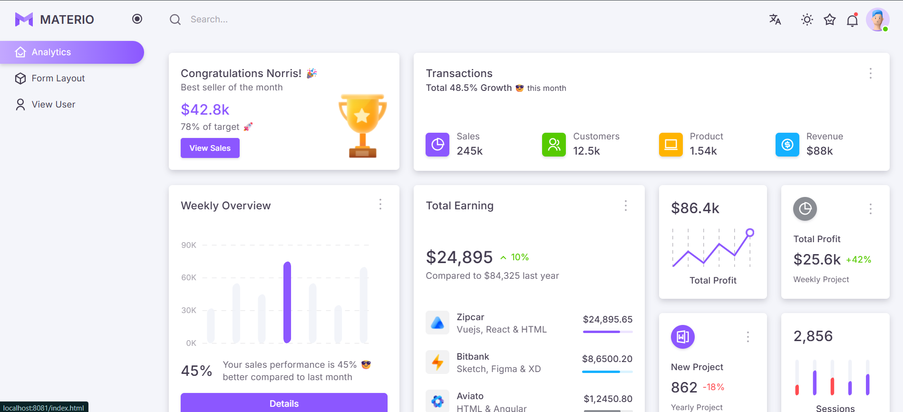
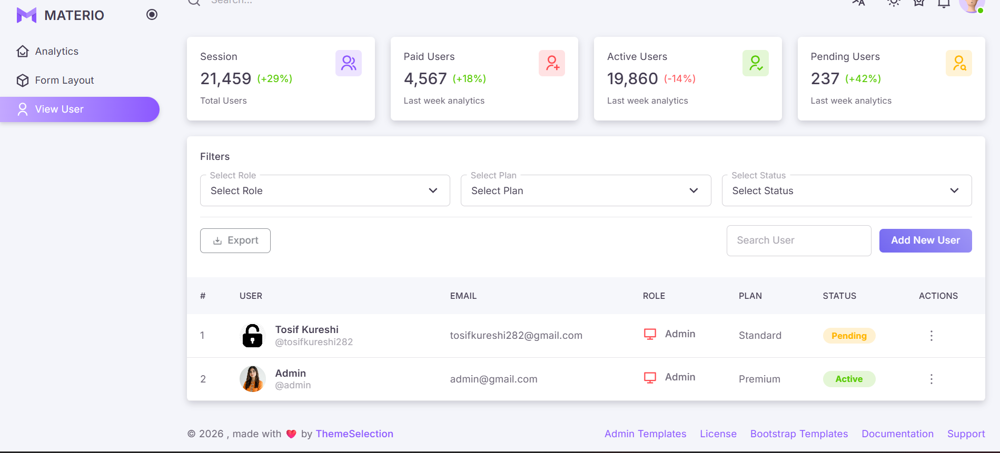

# 🧩 Admin Panel EJS

A clean Node.js, Express, MongoDB, and EJS admin dashboard built with Materio Bootstrap UI. It includes admin login, dashboard analytics, user CRUD, profile image uploads, searchable/filterable user lists, CSV export, dynamic role/status UI, and light/dark theme support.

## 📸 Screenshots

### 🔐 Login Page


### 📊 Dashboard


### ➕ Add User


### 👥 User List


## ✨ Features

- 🔐 Admin authentication with cookie-based login
- 📊 Dashboard page with analytics UI
- 👥 Add, view, edit, and delete users
- 🖼️ Profile image upload with Multer
- 🔎 User search and filters by role, plan, and status
- 📤 CSV export for visible/filtered users
- 🏷️ Dynamic role icons and status pill badges
- 🌗 Light, dark, and system theme switcher
- 🧱 Shared EJS partials for header, navbar, sidebar, footer, and scripts
- 📁 Static assets served from `public`

## 🛠️ Tech Stack

- 🟢 Node.js
- 🚀 Express.js
- 🧩 EJS
- 🍃 MongoDB
- 🔗 Mongoose
- 🖼️ Multer
- 🍪 Cookie Parser
- 🎨 Bootstrap / Materio assets

## 📁 Project Structure

```text
.
|-- config/
|   `-- db.js
|-- controller/
|   `-- adminController.js
|-- model/
|   `-- adminSchema.js
|-- public/
|   |-- assets/
|   |-- screenshot/
|   `-- uploads/
|-- routes/
|   `-- adminRoute.js
|-- views/
|   |-- pages/
|   `-- partials/
|-- index.js
|-- package.json
`-- README.md
```

## ✅ Requirements

- Node.js installed
- MongoDB running locally
- npm installed

The database connection currently uses:

```js
mongodb://localhost:27017/adminDB
```

You can change it in `config/db.js` if needed.

## 🚀 Installation & Run

Install dependencies:

```bash
npm install
```

Start MongoDB locally, then run the project:

```bash
npm run dev
```

Open the app:

```text
http://localhost:8081
```

## 🔑 Default Admin Login

The app creates a default admin automatically if it does not already exist.

```text
Email: admin@gmail.com
Password: 1234
```

## 🧭 Main Routes

| Method | Route | Description |
| --- | --- | --- |
| GET | `/login` | Login page |
| POST | `/login` | Login submit |
| GET | `/logout` | Logout admin |
| GET | `/` | Dashboard |
| GET | `/dashboard` | Dashboard |
| GET | `/form-layout` | Add user page |
| POST | `/users/add` | Create user |
| GET | `/users` | User list |
| GET | `/users/edit/:id` | Edit user page |
| POST | `/users/update/:id` | Update user |
| POST | `/users/delete/:id` | Delete user |

## 🧾 User Model

Users are stored with these fields:

- `fullName`
- `phoneNumber`
- `email`
- `password`
- `role`
- `plan`
- `status`
- `Image`
- `note`

Uploaded images are stored in:

```text
public/uploads
```

## 📜 Scripts

```bash
npm run dev
```

Runs the app with Nodemon.

## ⚠️ Production Notes

- Passwords are currently stored as plain text. Use `bcrypt` before production.
- Auth uses a simple `userId` cookie. Use stronger session handling for production.
- The MongoDB URL is hardcoded in `config/db.js`; environment variables are recommended.
- Uploaded files should be validated more strictly before production use.

## 🙌 Credits

UI assets are based on the Materio Bootstrap admin template by ThemeSelection.
